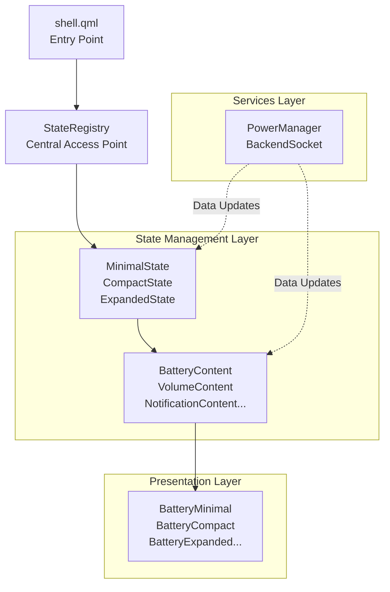
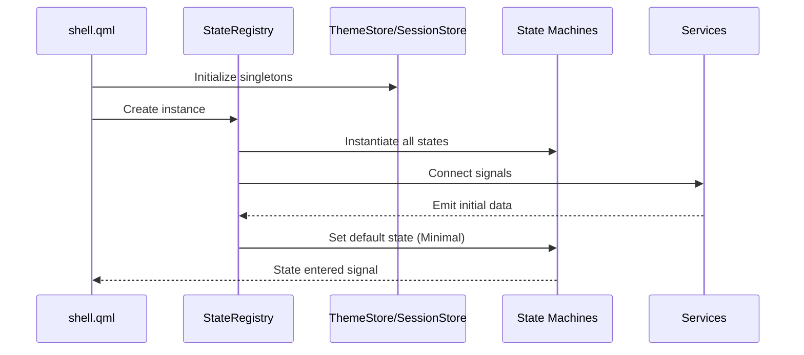
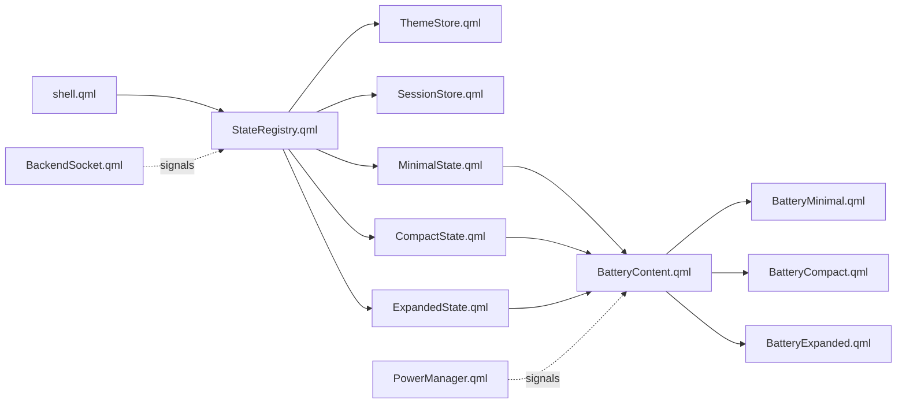

# Quickshell Architecture

> **Version:** 1.0.0 | **Last Updated:** 2025-07-18  
> See also: [README.md](README.md) | [CONVENTION.md](CONVENTION.md) | [MEMORY.md](MEMORY.md) | [STATECHART.md](state/STATECHART.md)

## Overview

Quickshell is a QtQuick/QML-based shell interface that implements a **Hierarchical State Machine (HSM)** architecture with content projections. The system adapts its UI presentation based on the current mode (Minimal, Compact, Expanded) while maintaining clean separation between state management, domain logic, and visual representation.

---

## System Architecture

### High-Level Data Flow



---

## Directory Structure

The project follows a strict layered architecture:

```
quickshell/
├── shell.qml                     # Entry point - initializes state registry
├── config.json                   # Runtime configuration
├── services/                     # Backend abstractions & IPC
│   ├── ipc/                      # Communication handlers
│   │   └── BackendSocket.qml     # Socket/DBus communication
│   └── system/                   # System-level singletons
│       └── PowerManager.qml      # Power/battery management
├── state/                        # PURE STATE MANAGEMENT
│   ├── STATECHART.md             # HSM documentation
│   ├── stores/                   # Global reactive state (singletons)
│   │   ├── ThemeStore.qml        # Centralized theme tokens
│   │   └── SessionStore.qml      # Session-wide state
│   ├── StateRegistry.qml         # Central access point for all state
│   ├── machines/                 # Hierarchical State Machines
│   │   ├── MinimalState.qml      # Minimal super state
│   │   ├── CompactState.qml      # Compact super state
│   │   └── ExpandedState.qml     # Expanded super state
│   ├── content/                  # Domain logic & data properties
│   │   ├── BatteryContent.qml
│   │   ├── VolumeContent.qml
│   │   ├── BrightnessContent.qml
│   │   ├── TimerContent.qml
│   │   ├── NotificationContent.qml
│   │   ├── CallContent.qml
│   │   ├── SearchContent.qml
│   │   ├── WorkspaceContent.qml
│   │   └── MeetingContent.qml
│   └── projections/              # Mode-specific visual adaptors
│       ├── battery/
│       │   ├── BatteryMinimal.qml
│       │   ├── BatteryCompact.qml
│       │   └── BatteryExpanded.qml
│       ├── volume/
│       │   ├── VolumeCompact.qml
│       │   └── VolumeExpanded.qml
│       ├── brightness/
│       │   ├── BrightnessCompact.qml
│       │   └── BrightnessExpanded.qml
│       ├── timer/
│       │   ├── TimerMinimal.qml
│       │   ├── TimerCompact.qml
│       │   └── TimerExpanded.qml
│       ├── notification/
│       │   ├── notiMinimal.qml
│       │   ├── notiCompact.qml
│       │   └── notiExpanded.qml
│       ├── call/
│       │   ├── callMinimal.qml
│       │   └── callCompact.qml
│       ├── search/
│       │   ├── searchCompact.qml
│       │   └── searchExpanded.qml
│       ├── workspace/
│       │   └── workspaceMinimal.qml
│       └── meeting/
│           ├── meetingMinimal.qml
│           └── meetingCompact.qml
```

---

## Core Architectural Patterns

### 1. Hierarchical State Machine (HSM)

The UI operates in three mutually exclusive **super states**:

| State | Purpose | Typical Content |
|-------|---------|-----------------|
| **Minimal** | Smallest footprint, essential info only | Battery flash, notification dot, workspace number |
| **Compact** | Moderate detail with quick controls | Battery alert, message preview, volume slider |
| **Expanded** | Full-featured view with complete controls | Battery stats, full message, custom timer setup |

#### State Machine Responsibilities

Each state machine (`MinimalState.qml`, `CompactState.qml`, `ExpandedState.qml`) manages:

- **State entry/exit signals** - Notifies when state becomes active/inactive
- **Active status tracking** - `isActive` property for conditional rendering
- **Current content selection** - `currentContent` property indicating which domain is active
- **Transition guards** - Conditions that must be met for state changes

See [STATECHART.md](state/STATECHART.md) for detailed state transition diagrams.

### 2. Content-Projections Separation

This pattern separates **what** to display from **how** to display it:

#### Content Layer (`state/content/*.qml`)
- Contains domain-specific logic and data properties
- Agnostic to visual presentation mode
- Example: `BatteryContent.qml` holds `batteryLevel`, `isCharging`, `timeRemaining`

#### Projection Layer (`state/projections/*/*.qml`)
- Visual representation tailored to a specific mode
- Receives data from content layer via properties
- Example: `BatteryMinimal.qml` shows simple bar, `BatteryExpanded.qml` shows detailed stats

**Benefits:**
- Reuse domain logic across modes without duplication
- Independent visual customization per projection
- Clean separation of concerns (logic vs. presentation)
- Easy to add new modes without modifying content

### 3. Store Pattern

Global reactive state is managed through singleton stores:

#### ThemeStore.qml
Centralized theme tokens for consistent styling:
```qml
QtObject {
    property color surfaceColor: "#333333"
    property color errorColor: "#f44336"
    property color successColor: "#4caf50"
    property real radiusLg: 20
    property real radiusSm: 2
}
```

#### SessionStore.qml
Session-wide state accessible across components:
- User preferences
- Current session context
- Persistent settings

#### StateRegistry.qml
Central access point that:
- Instantiates all state machines
- Provides unified API for state queries
- Manages state transitions
- Coordinates between services and UI

---

## Component Lifecycle

### Initialization Flow



### Runtime Data Flow

1. **Service Update**: `PowerManager` detects battery level change
2. **Signal Emission**: `batteryLevelChanged(int)` signal fired
3. **Content Update**: Connected `BatteryContent` updates property
4. **Projection Refresh**: Active projection re-renders with new data
5. **Visual Feedback**: User sees updated battery indicator

---

## State Transitions

### Transition Triggers

| From | To | Trigger |
|------|-----|---------|
| Minimal | Compact | User interaction (click/hover) |
| Compact | Expanded | Extended interaction or specific event |
| Expanded | Compact | Timeout or dismiss action |
| Compact | Minimal | Loss of focus or timeout |
| Any | Minimal | System sleep, critical alert |

### Transition Guards

Transitions are guarded by conditions:
- **Priority events**: Incoming call forces Expanded state
- **System state**: Low battery may restrict transitions
- **User preference**: Settings can disable certain transitions

See [STATECHART.md](state/STATECHART.md) for complete transition matrix.

---

## Services Layer

### PowerManager.qml

System-level singleton providing:
- Battery level monitoring
- Charging state detection
- Screen brightness control
- Power state management (active/suspend/shutdown)

**Signals:**
- `batteryLevelChanged(int level)`
- `powerStateChanged(string state)`
- `screenBrightnessChanged(int brightness)`

### BackendSocket.qml

IPC communication handler for:
- Socket-based communication with backend services
- DBus integration for system events
- Message serialization/deserialization

**Features:**
- Automatic reconnection logic
- Connection state tracking
- Error handling and reporting

---

## Module System

### QML Module Registration

The project uses Qt's QML module system for proper imports:

```cmake
qt_add_qml_module(quickshell
    URI Quickshell
    VERSION 1.0
    QML_FILES
        shell.qml
        state/StateRegistry.qml
        state/stores/ThemeStore.qml
        state/stores/SessionStore.qml
        state/machines/MinimalState.qml
        state/machines/CompactState.qml
        state/machines/ExpandedState.qml
        # ... all other QML files
    SERVICES
        services/system/PowerManager.qml
        services/ipc/BackendSocket.qml
)
```

### Import Structure

Components import using registered URIs:
```qml
import QtQuick
import Quickshell.State
import Quickshell.Services
import Quickshell.Stores
```

This enables:
- Type-safe imports
- Better IDE support
- Cleaner refactoring
- Proper dependency tracking

---

## Performance Considerations

### Object Creation
- State machines are singletons, created once at startup
- Projections are loaded on-demand using `Loader` for non-active states
- Content objects persist across state transitions

### Binding Optimization
- Complex calculations extracted to `readonly properties`
- Canvas elements minimized (only in `TimerMinimal.qml`)
- `clip: true` used sparingly to maintain batching

### Memory Management
- Signals use weak references where possible
- No circular dependencies between components
- Proper cleanup on state exit

---

## Testing Strategy

### Unit Tests (`.spec.qml`)
Co-located test files for each component:
```qml
// BatteryContent.spec.qml
TestCase {
    function test_batteryLevel_update() {
        var content = createTemporaryObject(BatteryContent, root);
        content.batteryLevel = 50;
        compare(content.batteryLevel, 50);
    }
}
```

### Integration Tests
Test critical user flows:
- State transition sequences
- Service-to-UI data propagation
- Multi-component interactions

### Visual Regression
Screenshot comparison for:
- All themed states
- Different content types
- Animation endpoints

---

## Extension Points

### Adding New Content Type

1. Create content file in `state/content/`:
```qml
// NetworkContent.qml
QtObject {
    property int signalStrength: 0
    property string connectionType: "wifi"
    property bool isConnected: false
}
```

2. Create projections in `state/projections/network/`:
- `NetworkMinimal.qml`
- `NetworkCompact.qml`
- `NetworkExpanded.qml`

3. Register in `StateRegistry.qml`

### Adding New State Mode

1. Create state machine in `state/machines/`:
```qml
// FocusState.qml
QtObject {
    signal stateEntered()
    signal stateExited()
    property bool isActive: false
    // ...
}
```

2. Create projections for existing content types
3. Define transition rules in `StateRegistry.qml`

---

## File Relationships

### Dependency Graph



### Import Dependencies

| File | Imports |
|------|---------|
| `shell.qml` | StateRegistry, ThemeStore |
| `StateRegistry.qml` | All state machines, all content types |
| `*Content.qml` | None (pure data) |
| `*Minimal.qml` | Corresponding Content |
| `*Compact.qml` | Corresponding Content |
| `*Expanded.qml` | Corresponding Content |
| Services | QtQuick only |

---

## Conventions Reference

All code follows strict conventions defined in [CONVENTION.md](CONVENTION.md):

- **File naming**: PascalCase for components, singular nouns
- **Component structure**: 9-section ordering (metadata → functions)
- **Properties**: Typed, `required` for inputs, no hardcoded values
- **Imports**: Grouped and sorted, URI-based for internal modules
- **JavaScript**: Minimized, inline only when necessary
- **Accessibility**: `Accessible.role` and `Accessible.name` required
- **Testing**: 90% coverage target with co-located `.spec.qml` files

---

## Future Enhancements

### Planned
1. **Animation constants**: Standardized duration and easing curves
2. **Enhanced StateRegistry**: Full transition management
3. **UI component library**: Reusable primitives in `ui/` directory
4. **Comprehensive test suite**: Unit, integration, and visual tests

### Technical Debt
- Projection naming inconsistency (some camelCase, some PascalCase)
- Incomplete theme integration (hardcoded colors in some projections)
- STATECHART.md needs detailed transition diagrams
- Test coverage not yet implemented

---

## Related Documentation

- **[README.md](README.md)**: Project overview and quick start
- **[CONVENTION.md](CONVENTION.md)**: Coding standards and best practices
- **[MEMORY.md](MEMORY.md)**: Long-term project knowledge and decisions
- **[STATECHART.md](state/STATECHART.md)**: Detailed HSM documentation
- **[CONTEXT.md](CONTEXT.md)**: Current session context

---

## Quick Reference

### Key Files
| File | Purpose |
|------|---------|
| [`shell.qml`](quickshell/shell.qml) | Application entry point |
| [`StateRegistry.qml`](quickshell/state/StateRegistry.qml) | Central state access |
| [`ThemeStore.qml`](quickshell/state/stores/ThemeStore.qml) | Theme tokens |
| [`PowerManager.qml`](quickshell/services/system/PowerManager.qml) | System power service |
| [`STATECHART.md`](state/STATECHART.md) | State machine documentation |

### Common Patterns
- Root element `id: root` in all components
- `objectName` set for testing/accessibility
- Signals for inter-component communication
- Properties for data flow (one-way binding preferred)
