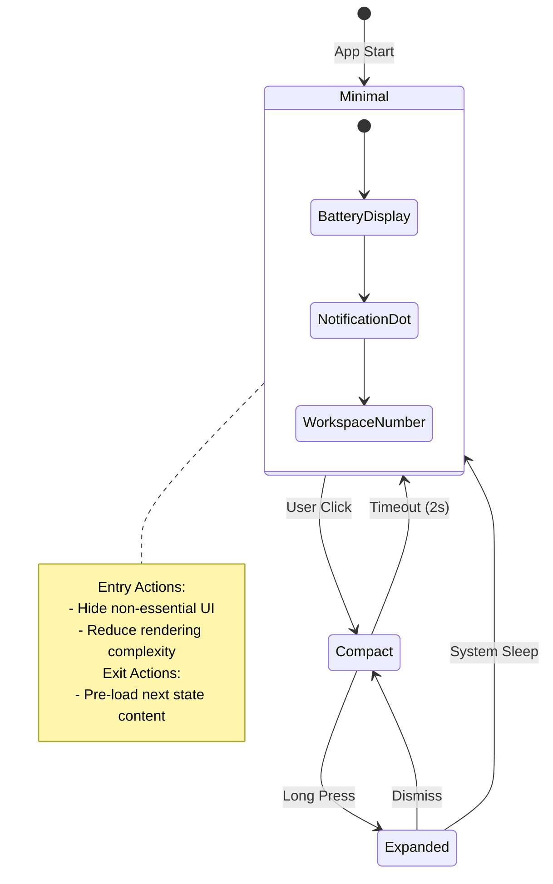

# SOLUTIONS.md

> **Proposed Solutions for Quickshell Improvements**  
> Implementation approaches for suggestions in [[SUGGESTIONS]]

---

## Table of Contents

1. [Architecture Solutions](#1-architecture-solutions)
2. [Content Solutions](#2-content-solutions)
3. [File Solutions](#3-file-solutions)
4. [Organization Solutions](#4-organization-solutions)
5. [Documentation Solutions](#5-documentation-solutions)

---

## 1. Architecture Solutions

### 1.1 State Machine Enhancement

#### Solution: Add New State Modes

**Implementation Steps:**

1. Create new state machine file:
```qml
// state/machines/FocusState.qml
QtObject {
    id: root
    objectName: "focusState"
    
    signal stateEntered()
    signal stateExited()
    
    property bool isActive: false
    property string currentContent: ""
    property bool allowNotifications: false
    
    function enter() {
        root.isActive = true;
        root.stateEntered();
    }
    
    function exit() {
        root.isActive = false;
        root.stateExited();
    }
}
```

2. Register in `StateRegistry.qml`:
```qml
property var focusState: null

function initializeStates(focus, /* ... */) {
    root.focusState = focus;
    // Connect signals
}
```

3. Add transition rules to transition matrix in STATECHART.md

**Estimated Effort:** 2-3 days per new state
**Dependencies:** None
**Risk Level:** Low

#### Solution: Animated State Transitions

**Implementation Steps:**

1. Create animation helper in stores:
```qml
// state/stores/TransitionStore.qml
QtObject {
    property real springStiffness: 400
    property real springDamping: 15
    property real springMass: 1
    
    function calculateSpringDuration() {
        return Math.sqrt(springMass / springStiffness) * 1000;
    }
}
```

2. Update projections to use Loader with animations:
```qml
Loader {
    id: projectionLoader
    source: currentState + "Projection.qml"
    
    PropertyAnimation {
        target: projectionLoader.item
        property: "opacity"
        from: 0
        to: 1
        duration: theme.durationNormal
        easing.type: Easing.OutQuad
    }
}
```

**Estimated Effort:** 3-4 days
**Dependencies:** ThemeStore updates
**Risk Level:** Medium (performance impact)

### 1.2 Service Layer Expansion

#### Solution: Implement NetworkManager

**Implementation Steps:**

1. Create service file:
```qml
// services/system/NetworkManager.qml
QtObject {
    id: root
    objectName: "networkManager"
    
    property int signalStrength: 0
    property string connectionType: "wifi"  // wifi, ethernet, cellular, none
    property bool isConnected: false
    property string ssid: ""
    
    signal signalStrengthChanged(int strength)
    signal connectionTypeChanged(string type)
    signal connectedChanged(bool connected)
    
    // Implementation using Qt Network APIs
}
```

2. Add corresponding content:
```qml
// state/content/NetworkContent.qml
QtObject {
    property int signalStrength: NetworkManager.signalStrength
    property string connectionType: NetworkManager.connectionType
    
    Connections {
        target: NetworkManager
        function onSignalStrengthChanged(strength) {
            root.signalStrength = strength;
        }
    }
}
```

3. Create projections for each state mode

**Estimated Effort:** 4-5 days
**Dependencies:** Qt Network module
**Risk Level:** Low

### 1.3 Store Pattern Enhancement

#### Solution: AnimationStore Implementation

**Implementation Steps:**

1. Create centralized animation store:
```qml
// state/stores/AnimationStore.qml
QtObject {
    // Durations
    property int instant: 100
    property int fast: 200
    property int normal: 350
    property int slow: 500
    property int morph: 600
    
    // Spring physics
    property real springStiffness: 400
    property real springDamping: 15
    property real springMass: 1
    
    // Easing curves
    readonly property variant easeOutQuad: Easing.OutQuad
    readonly property variant easeOutBack: Easing.OutBack
    readonly property variant easeInOut: Easing.InOutQuad
    
    // Pre-configured animations
    function createFadeAnimation(target, duration) {
        return Qt.createQmlObject(`
            import QtQuick
            NumberAnimation {
                target: ${target}
                property: "opacity"
                duration: ${duration}
                easing.type: Easing.OutQuad
            }
        `, parent);
    }
}
```

2. Update ThemeStore to reference AnimationStore or merge

**Estimated Effort:** 1-2 days
**Dependencies:** None
**Risk Level:** Low

### 1.4 Content-Projection Decoupling

#### Solution: Projection Factory Pattern

**Implementation Steps:**

1. Create factory component:
```qml
// state/ProjectionFactory.qml
QtObject {
    id: root
    
    property var loadedProjections: ({})
    property var projectionCache: ({})
    
    function getProjection(contentType, stateMode) {
        const key = contentType + "_" + stateMode;
        
        if (root.projectionCache[key]) {
            return root.projectionCache[key];
        }
        
        const source = resolveProjectionSource(contentType, stateMode);
        const projection = Qt.createQmlObject(source, parent);
        root.projectionCache[key] = projection;
        
        return projection;
    }
    
    function preloadProjection(contentType, stateMode) {
        // Pre-load projection without displaying
        getProjection(contentType, stateMode);
    }
}
```

**Estimated Effort:** 3-4 days
**Dependencies:** None
**Risk Level:** Medium (complexity increase)

---

## 2. Content Solutions

### 2.1 New Content Types

#### Solution: Template for New Content

**Standard Template:**
```qml
// state/content/[Name]Content.qml
QtObject {
    id: root
    objectName: "[name]Content"
    
    // === Domain Properties ===
    property var dataProperty: defaultValue
    
    // === Computed Properties ===
    readonly property bool derivedProperty: root.dataProperty > threshold
    
    // === Initialization ===
    Component.onCompleted: {
        console.log("[Name]Content initialized");
        connectToServices();
    }
    
    // === Service Connections ===
    function connectToServices() {
        // Connect to relevant service signals
    }
    
    // === Update Handlers ===
    function updateData(newValue) {
        root.dataProperty = newValue;
    }
}
```

### 2.2 Content Priority Queue

#### Solution: Priority Manager

**Implementation:**
```qml
// state/content/PriorityManager.qml
QtObject {
    id: root
    
    enum Priority {
        None = 0,
        Low = 1,
        Medium = 2,
        High = 3,
        Critical = 4
    }
    
    property var contentPriorities: ({
        "call": Priority.Critical,
        "meeting": Priority.High,
        "timer": Priority.Medium,
        "notification": Priority.Medium,
        "battery": Priority.Low,
        "workspace": Priority.None
    })
    
    function getHighestPriorityContent(activeContents) {
        let highest = null;
        let highestPriority = -1;
        
        for (const content of activeContents) {
            const priority = contentPriorities[content] || Priority.None;
            if (priority > highestPriority) {
                highest = content;
                highestPriority = priority;
            }
        }
        
        return highest;
    }
}
```

---

## 3. File Solutions

### 3.1 Naming Standardization

#### Solution: Batch Rename Script

**Create rename script:**
```bash
#!/bin/bash
# rename_projections.sh

cd quickshell/state/projections

# Notification
mv notification/notiMinimal.qml notification/NotificationMinimal.qml
mv notification/notiCompact.qml notification/NotificationCompact.qml
mv notification/notiExpanded.qml notification/NotificationExpanded.qml

# Call
mv call/callMinimal.qml call/CallMinimal.qml
mv call/callCompact.qml call/CallCompact.qml

# Search
mv search/searchCompact.qml search/SearchCompact.qml
mv search/searchExpanded.qml search/SearchExpanded.qml

# Workspace
mv workspace/workspaceMinimal.qml workspace/WorkspaceMinimal.qml

# Meeting
mv meeting/meetingMinimal.qml meeting/MeetingMinimal.qml
mv meeting/meetingCompact.qml meeting/MeetingCompact.qml

echo "Rename complete. Update imports in dependent files."
```

**Update all imports:**
```bash
# Find and replace in all QML files
find . -name "*.qml" -exec sed -i 's/notiMinimal/NotificationMinimal/g' {} \;
find . -name "*.qml" -exec sed -i 's/notiCompact/NotificationCompact/g' {} \;
# ... etc for all renames
```

**Estimated Effort:** 1 day
**Dependencies:** None
**Risk Level:** Low (breaking change, requires testing)

### 3.2 Missing Files Creation

#### Solution: File Templates

**CHANGELOG.md Template:**
```markdown
# Changelog

All notable changes to this project will be documented in this file.

## [Unreleased]

### Added
### Changed
### Deprecated
### Removed
### Fixed
### Security

## [1.0.0] - 2025-07-18

### Added
- Initial release
- Hierarchical State Machine architecture
- iOS Dynamic Island design language
- Three super states (Minimal, Compact, Expanded)
- Nine content types with projections
```

**CONTRIBUTING.md Template:**
```markdown
# Contributing to Quickshell

## Development Setup

1. Install Qt 6.7+
2. Install CMake 3.16+
3. Clone repository
4. Build: `mkdir build && cd build && cmake .. && make`

## Code Style

- Follow CONVENTION.md strictly
- Use PascalCase for components
- No hardcoded values (use ThemeStore)
- 9-section component structure

## Pull Request Process

1. Create feature branch
2. Make changes following conventions
3. Add/update tests
4. Update documentation
5. Submit PR with description
```

---

## 4. Organization Solutions

### 4.1 Directory Restructuring

#### Solution: Phased Migration

**Phase 1: Create New Directories**
```bash
mkdir -p quickshell/ui/common
mkdir -p quickshell/ui/indicators
mkdir -p quickshell/ui/controls
mkdir -p quickshell/utils
mkdir -p quickshell/tests/unit
mkdir -p quickshell/tests/integration
mkdir -p quickshell/assets/icons
```

**Phase 2: Move Files (Non-Breaking)**
- Copy files first, keep originals
- Update imports incrementally
- Test after each move

**Phase 3: Remove Old Locations**
- Only after all imports updated
- Verify no broken references

**Estimated Effort:** 3-5 days
**Dependencies:** None
**Risk Level:** Medium (import path changes)

### 4.2 Module Separation

#### Solution: Component Extraction Guidelines

**When to Extract (>300 lines):**
1. Multiple responsibilities detected
2. Repeated code patterns
3. Complex nested structures
4. Difficult to test as single unit

**Extraction Process:**
1. Identify extractable section
2. Create new component file
3. Define public API (properties, signals)
4. Replace with component usage
5. Update imports
6. Test functionality

---

## 5. Documentation Solutions

### 5.1 Complete STATECHART.md

#### Solution: Detailed Transition Diagrams

**Add mermaid diagrams:**


**Add transition table:**
| ID | From | To | Trigger | Guard | Action |
|----|------|-----|---------|-------|--------|
| T1 | Minimal | Compact | click | none | loadCompactProjection() |
| T2 | Compact | Minimal | timeout | !interacting | saveState(), unloadProjection() |

### 5.2 API Reference Generation

#### Solution: QDoc Configuration

**Create qdocconf file:**
```qdocconf
# quickshell.qdocconf
project = Quickshell
title = Quickshell API Reference
version = 1.0.0

qhp_projects.title = Quickshell
qhp_projects.version = 1.0.0
qhp_projects.virtualFolder = qch

sources += ../quickshell/*.qml
sources += ../quickshell/state/*.qml

outputdir = docs/api
```

**Add QML comments:**
```qml
/*!
    \qmltype BatteryContent
    \inmodule Quickshell
    \brief Domain object for battery state data
    
    This content object holds battery-related properties and
    connects to PowerManager service for updates.
    
    \property int batteryLevel
        Current battery level (0-100)
    
    \property bool isCharging
        Whether device is currently charging
    
    \since Quickshell 1.0
*/
QtObject {
    // ...
}
```

### 5.3 Documentation Maintenance

#### Solution: CI Integration

**GitHub Actions workflow:**
```yaml
# .github/workflows/docs.yml
name: Documentation Check

on: [pull_request]

jobs:
  docs:
    runs-on: ubuntu-latest
    steps:
      - uses: actions/checkout@v3
      
      - name: Check documentation updates
        run: |
          # Verify README files exist
          find . -name "*.md" -type f | wc -l
          
          # Check for broken links
          npx markdown-link-check **/*.md
          
          # Validate mermaid syntax
          npx @mermaid-js/mermaid-cli validate **/*.md
```

---

## 6. Design Pattern Solutions

### 6.1 Factory Pattern Implementation

#### Solution: ProjectionFactory Component

**Implementation Steps:**

1. Create factory component:
```qml
// state/ProjectionFactory.qml
QtObject {
    id: root
    
    property var loadedProjections: ({})
    property var projectionCache: ({})
    
    function getProjection(contentType, stateMode) {
        const key = contentType + "_" + stateMode;
        
        if (root.projectionCache[key]) {
            return root.projectionCache[key];
        }
        
        const source = resolveProjectionSource(contentType, stateMode);
        const projection = Qt.createQmlObject(source, parent);
        root.projectionCache[key] = projection;
        
        return projection;
    }
    
    function preloadProjection(contentType, stateMode) {
        // Pre-load projection without displaying
        getProjection(contentType, stateMode);
    }
    
    function resolveProjectionSource(contentType, stateMode) {
        // Map content types and states to QML file paths
        const mapping = {
            "battery": {
                "minimal": "BatteryMinimal.qml",
                "compact": "BatteryCompact.qml",
                "expanded": "BatteryExpanded.qml"
            }
            // ... other mappings
        };
        return mapping[contentType][stateMode];
    }
}
```

**Estimated Effort:** 3-4 days
**Dependencies:** None
**Risk Level:** Medium (complexity increase)

### 6.2 Command Pattern Implementation

#### Solution: State Transition Commands

**Implementation Steps:**

1. Create command base class:
```qml
// state/commands/StateCommand.qml
QtObject {
    id: root
    
    signal executed()
    signal undone()
    
    property bool canExecute: true
    property bool canUndo: false
    
    function execute() {
        console.log("Executing command");
        root.executed();
    }
    
    function undo() {
        if (root.canUndo) {
            console.log("Undoing command");
            root.undone();
        }
    }
}
```

2. Create concrete command for state transitions:
```qml
// state/commands/TransitionToCompactCommand.qml
StateCommand {
    id: root
    
    property var fromState: null
    property var toState: null
    
    function execute() {
        if (!root.canExecute) return;
        
        // Save previous state for undo
        var previousState = fromState;
        
        // Execute transition
        fromState.exit();
        toState.enter();
        
        root.executed();
    }
    
    function undo() {
        toState.exit();
        fromState.enter();
        root.undone();
    }
}
```

3. Create command manager:
```qml
// state/CommandManager.qml
QtObject {
    id: root
    
    property var commandHistory: []
    property int historyIndex: -1
    
    function executeCommand(command) {
        // Remove any future commands if we're not at the end
        if (root.historyIndex < root.commandHistory.length - 1) {
            root.commandHistory = root.commandHistory.slice(0, root.historyIndex + 1);
        }
        
        command.execute();
        root.commandHistory.push(command);
        root.historyIndex++;
    }
    
    function undo() {
        if (root.historyIndex >= 0) {
            root.commandHistory[root.historyIndex].undo();
            root.historyIndex--;
        }
    }
    
    function redo() {
        if (root.historyIndex < root.commandHistory.length - 1) {
            root.historyIndex++;
            root.commandHistory[root.historyIndex].execute();
        }
    }
}
```

**Estimated Effort:** 2-3 days
**Dependencies:** None
**Risk Level:** Low

### 6.3 Mediator Pattern Enhancement

#### Solution: Formalize StateRegistry as Mediator

**Implementation Steps:**

1. Define mediator interface in StateRegistry:
```qml
// state/StateRegistry.qml (enhanced)
QtObject {
    id: root
    objectName: "stateMediator"
    
    // === Mediator Interface ===
    
    function notifyComponentEvent(componentId, eventType, data) {
        // Centralized event routing
        switch(eventType) {
            case "stateRequest":
                handleStateRequest(componentId, data);
                break;
            case "contentUpdate":
                broadcastContentUpdate(componentId, data);
                break;
        }
    }
    
    function registerComponent(componentId, component) {
        // Register component for mediated communication
        registeredComponents[componentId] = component;
    }
    
    function unregisterComponent(componentId) {
        delete registeredComponents[componentId];
    }
    
    // === Internal Mediation Logic ===
    
    function handleStateRequest(requesterId, targetState) {
        // Validate and route state transition requests
        if (canTransition(root.currentState, targetState)) {
            transitionTo(targetState);
        }
    }
    
    function broadcastContentUpdate(sourceId, updateData) {
        // Notify all interested components of content changes
        for (var id in registeredComponents) {
            if (id !== sourceId && registeredComponents[id].onContentUpdate) {
                registeredComponents[id].onContentUpdate(updateData);
            }
        }
    }
}
```

**Estimated Effort:** 1-2 days
**Dependencies:** None
**Risk Level:** Low

### 6.4 Flyweight Pattern Implementation

#### Solution: Shared Intrinsic State

**Implementation Steps:**

1. Create AnimationStore (already suggested in Architecture):
```qml
// state/stores/AnimationStore.qml
pragma Singleton
import QtQuick

QtObject {
    // Shared animation configurations (intrinsic state)
    readonly property real springStiffness: 400
    readonly property real springDamping: 15
    readonly property real springMass: 1
    
    readonly property int durationInstant: 100
    readonly property int durationFast: 200
    readonly property int durationNormal: 350
    readonly property int durationSlow: 500
    
    // Factory methods for shared animations
    function createFadeAnimation(parent) {
        return Qt.createQmlObject(`
            import QtQuick
            NumberAnimation {
                property: "opacity"
                duration: ${durationNormal}
                easing.type: Easing.OutQuad
            }
        `, parent);
    }
}
```

2. Update projections to use shared state:
```qml
// Example projection using flyweight
QtObject {
    id: root
    
    // Extrinsic state (unique to this instance)
    property real opacityValue: 0.0
    
    // Intrinsic state (shared via stores)
    readonly property int animationDuration: AnimationStore.durationNormal
    readonly property real springStiffness: AnimationStore.springStiffness
    
    // Use shared animation factory
    PropertyAnimation {
        target: root
        property: "opacityValue"
        duration: AnimationStore.durationNormal
        easing.type: AnimationStore.easeOutQuad
    }
}
```

**Estimated Effort:** 1-2 days (overlaps with AnimationStore implementation)
**Dependencies:** None
**Risk Level:** Low

### 6.5 Chain of Responsibility Pattern Implementation

#### Solution: Priority Event Handler Chain

**Implementation Steps:**

1. Create handler base class:
```qml
// state/content/handlers/ContentHandler.qml
QtObject {
    id: root
    
    property var nextHandler: null
    property int priority: 0
    
    function handleRequest(contentData) {
        if (canHandle(contentData)) {
            processContent(contentData);
        } else if (root.nextHandler) {
            root.nextHandler.handleRequest(contentData);
        }
    }
    
    function canHandle(contentData) {
        // Override in subclasses
        return false;
    }
    
    function processContent(contentData) {
        // Override in subclasses
        console.log("Processing content:", contentData);
    }
}
```

2. Create concrete handlers:
```qml
// state/content/handlers/CriticalContentHandler.qml
ContentHandler {
    id: root
    priority: 4  // Critical priority
    
    function canHandle(contentData) {
        return contentData.priority === "critical";
    }
    
    function processContent(contentData) {
        // Handle critical content immediately
        console.log("Critical content:", contentData);
        displayImmediately(contentData);
    }
}

// state/content/handlers/NormalContentHandler.qml
ContentHandler {
    id: root
    priority: 2  // Normal priority
    
    function canHandle(contentData) {
        return contentData.priority === "normal";
    }
    
    function processContent(contentData) {
        // Handle normal content with standard display
        console.log("Normal content:", contentData);
        displayNormally(contentData);
    }
}
```

3. Build the chain in PriorityManager:
```qml
// state/content/PriorityManager.qml (enhanced)
QtObject {
    id: root
    
    property var handlerChain: null
    
    Component.onCompleted: {
        // Build chain: Critical -> High -> Medium -> Low -> None
        var criticalHandler = Qt.createQmlObject("CriticalContentHandler.qml", root);
        var highHandler = Qt.createQmlObject("HighContentHandler.qml", root);
        var mediumHandler = Qt.createQmlObject("MediumContentHandler.qml", root);
        var lowHandler = Qt.createQmlObject("LowContentHandler.qml", root);
        
        criticalHandler.nextHandler = highHandler;
        highHandler.nextHandler = mediumHandler;
        mediumHandler.nextHandler = lowHandler;
        
        root.handlerChain = criticalHandler;
    }
    
    function processContent(contentData) {
        if (root.handlerChain) {
            root.handlerChain.handleRequest(contentData);
        }
    }
}
```

**Estimated Effort:** 2-3 days
**Dependencies:** None
**Risk Level:** Low-Medium

---

## Implementation Priority Matrix

| Solution | Impact | Effort | Risk | Priority |
|----------|--------|--------|------|----------|
| Naming Standardization | High | Low | Low | P0 |
| STATECHART Completion | High | Low | None | P0 |
| NetworkManager | Medium | Medium | Low | P1 |
| AnimationStore (Flyweight) | Medium | Low | Low | P1 |
| Factory Pattern | Medium | Medium | Medium | P2 |
| Command Pattern | Medium | Medium | Low | P2 |
| Mediator Enhancement | Low | Low | Low | P2 |
| Chain of Responsibility | Medium | Medium | Low-Medium | P3 |
| FocusState | Low | Medium | Low | P2 |
| Directory Restructure | Medium | High | Medium | P3 |

---

> **Next Step:** Review [[PROBLEMS]] for potential drawbacks and risk analysis before implementation.
