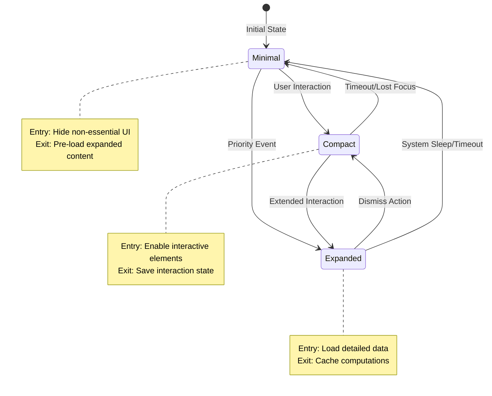

# state/machines/ Directory

## Purpose
The `machines/` directory contains the **Hierarchical State Machine (HSM)** implementations that manage the three super states of the Quickshell UI: Minimal, Compact, and Expanded. Each state machine is responsible for its own lifecycle and tracks which content is currently active.

## Architecture Role
This is the **state machine layer** within the state management system:
- **Manages** mutually exclusive super states
- **Emits** lifecycle signals on state enter/exit
- **Tracks** active status and current content selection
- **Coordinates** with StateRegistry for transitions

## Directory Tree
```
machines/
├── MinimalState.qml      # Minimal super state (smallest footprint)
├── CompactState.qml      # Compact super state (moderate detail)
└── ExpandedState.qml     # Expanded super state (full-featured)
```

## Parent-Sibling-Child Relationships

### Parent
- **Parent:** `state/` - The state management directory

### Siblings
- **`stores/`** - State machines may reference SessionStore for guard conditions
- **`content/`** - State machines track which content is active via `currentContent` property
- **`projections/`** - State machines determine which projections are loaded
- **`StateRegistry.qml`** - Registry coordinates transitions between state machines

### Children
- **None** - All three state machines are leaf components

## Key Files

| File | Purpose | Super State | Typical Content |
|------|---------|-------------|-----------------|
| `MinimalState.qml` | Minimal state machine | Smallest UI, passive display | Battery flash, notification dot, workspace number |
| `CompactState.qml` | Compact state machine | Moderate UI, quick controls | Battery alert, message preview, volume slider |
| `ExpandedState.qml` | Expanded state machine | Full UI, complete controls | Battery stats, full message, custom timer setup |

## State Machine Structure

All three state machines follow the same pattern:

```qml
// MinimalState.qml example
QtObject {
    id: root
    objectName: "minimalState"
    
    // === Lifecycle Signals ===
    signal stateEntered()
    signal stateExited()
    
    // === State Properties ===
    property bool isActive: false
    property string currentContent: ""
    
    // === Initialization ===
    Component.onCompleted: {
        console.log("MinimalState initialized");
    }
    
    // === State Transitions ===
    function enter() {
        root.isActive = true;
        root.stateEntered();
    }
    
    function exit() {
        root.isActive = false;
        root.stateExited();
    }
}
```

## State Characteristics

### MinimalState
- **Purpose**: Display essential information at a glance
- **Size**: Smallest footprint (typically 40-60px wide)
- **Interaction**: None (passive display only)
- **Use Cases**: 
  - Battery level indicator
  - Unread notification count
  - Current workspace number
  - Meeting status dot

### CompactState
- **Purpose**: Provide moderate detail with quick controls
- **Size**: Medium footprint (typically 150-250px wide)
- **Interaction**: Limited (sliders, buttons)
- **Use Cases**:
  - Volume/brightness adjustment
  - Message preview
  - Timer countdown with pause/resume
  - Call controls (mute, hold)

### ExpandedState
- **Purpose**: Full-featured view with complete controls
- **Size**: Largest footprint (typically 300-500px wide)
- **Interaction**: Full (all controls available)
- **Use Cases**:
  - Detailed battery statistics
  - Full message thread
  - Custom timer configuration
  - Search results list

## State Lifecycle



## Usage in StateRegistry

```qml
// In StateRegistry.qml
property var minimalState: null
property var compactState: null
property var expandedState: null

function initializeStateMachines(minimal, compact, expanded) {
    root.minimalState = minimal;
    root.compactState = compact;
    root.expandedState = expanded;
    
    // Connect state signals
    minimal.stateEntered.connect(onMinimalEntered);
    minimal.stateExited.connect(onMinimalExited);
    // ... etc
}

function transitionTo(newState, reason) {
    // Exit current state
    exitCurrentState();
    
    // Enter new state
    enterNewState(newState);
    
    root.currentState = newState;
    root.stateChanged(newState);
}
```

## Transition Guards

State transitions can be guarded by conditions:

```qml
// Example guard in StateRegistry
function canTransitionTo(newState) {
    switch (newState) {
        case "expanded":
            return !SessionStore.doNotDisturb || hasPriorityEvent;
        case "compact":
            return true;  // Always allowed
        case "minimal":
            return !hasPriorityEvent;  // Can't minimize during priority
    }
}
```

## Design Principles

1. **Mutually Exclusive**: Only one state is active at any time
2. **Lifecycle Signals**: Clear enter/exit signals for coordination
3. **Active Tracking**: `isActive` property for conditional rendering
4. **Content Agnostic**: State machines don't know about specific projections
5. **Registry Coordination**: StateRegistry manages all transitions

## Testing Considerations

- Test state enter/exit functions
- Verify `isActive` property updates correctly
- Test signal emission on state changes
- Test concurrent access prevention (isTransitioning guard)

## Related Documentation

- [../../ARCHITECTURE.md](../../ARCHITECTURE.md) - System architecture
- [../README.md](../README.md) - State layer overview
- [../STATECHART.md](../STATECHART.md) - Detailed state transition diagrams
- [../StateRegistry.qml](../StateRegistry.qml) - Transition coordinator
- [../../MEMORY.md](../../MEMORY.md) - HSM implementation patterns
