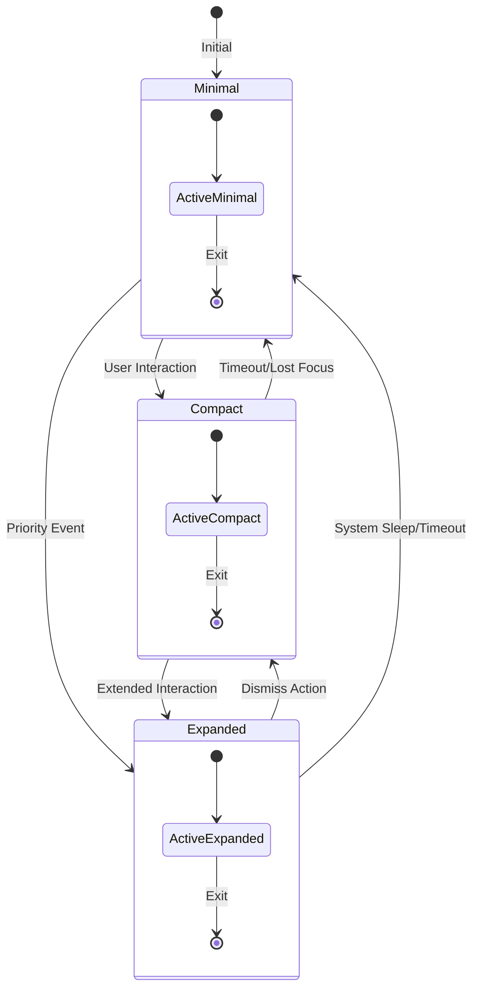
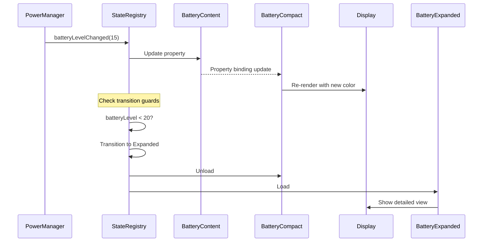
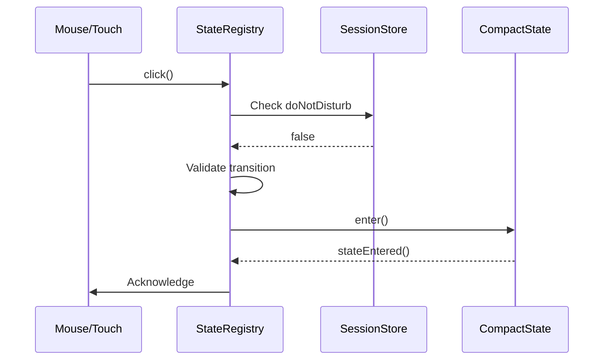

# STATECHART.md

> **Hierarchical State Machine Documentation**  
> See also: [ARCHITECTURE.md](../ARCHITECTURE.md) | [MEMORY.md](../MEMORY.md)

## Overview

Quickshell implements a **Hierarchical State Machine (HSM)** that manages UI presentation across three mutually exclusive super states. This document details the state transitions, guards, entry/exit actions, and event flow.

---

## State Hierarchy

```
┌─────────────────────────────────────────┐
│           SUPER STATES                  │
│  ┌──────────┐  ┌──────────┐  ┌───────┐ │
│  │ Minimal  │  │ Compact  │  │Expanded│ │
│  │  State   │  │  State   │  │ State │ │
│  └──────────┘  └──────────┘  └───────┘ │
└─────────────────────────────────────────┘
              ↕ transitions ↕
┌─────────────────────────────────────────┐
│         CONTENT LAYER                   │
│  Battery │ Volume │ Notification │ ...  │
└─────────────────────────────────────────┘
              ↕ selects ↕
┌─────────────────────────────────────────┐
│       PROJECTION LAYER                  │
│  [Content][Minimal|Compact|Expanded]    │
└─────────────────────────────────────────┘
```

---

## Super States

### 1. MinimalState

**Purpose:** Smallest footprint, essential information only

**Characteristics:**
- Lowest resource consumption
- Passive display (no interaction)
- Critical info at a glance

**Active Projections:**
- `BatteryMinimal.qml` - Status flash with duration indicator
- `TimerMinimal.qml` - Mini arc progress
- `notiMinimal.qml` - Unread message count dot
- `callMinimal.qml` - Caller/receiver name only
- `workspaceMinimal.qml` - Slide to workspace number
- `meetingMinimal.qml` - Dot indicator (camera/mic)

**Entry Actions:**
1. Hide all non-essential UI elements
2. Reduce animation complexity
3. Set low-power rendering mode

**Exit Actions:**
1. Prepare expanded UI elements
2. Pre-load content for next state

---

### 2. CompactState

**Purpose:** Moderate detail with quick controls

**Characteristics:**
- Balanced information density
- Quick interaction available
- Contextual controls visible

**Active Projections:**
- `BatteryCompact.qml` - Alert + battery level
- `VolumeCompact.qml` - Volume based fill slider
- `BrightnessCompact.qml` - Brightness based fill
- `TimerCompact.qml` - Countdown + controls
- `notiCompact.qml` - Message content (truncated)
- `callCompact.qml` - Minimal + name + controls
- `searchCompact.qml` - Search bar
- `meetingCompact.qml` - Meeting control buttons

**Entry Actions:**
1. Expand UI from minimal state
2. Enable interactive elements
3. Load preview content

**Exit Actions:**
1. Save current interaction state
2. Collapse UI elements smoothly

---

### 3. ExpandedState

**Purpose:** Full-featured view with complete controls

**Characteristics:**
- Maximum information density
- Full interaction capability
- Detailed settings accessible

**Active Projections:**
- `BatteryExpanded.qml` - Battery status + usage + time left
- `VolumeExpanded.qml` - App + system volume mixer
- `BrightnessExpanded.qml` - Brightness + night light + auto
- `TimerExpanded.qml` - Set custom countdown
- `notiExpanded.qml` - Full message (extended limit)
- `searchExpanded.qml` - Compact + search results
- *(call has no expanded projection)*
- *(workspace has no expanded projection)*
- *(meeting has no expanded projection)*

**Entry Actions:**
1. Full UI expansion
2. Load detailed data
3. Enable all controls
4. Start background refresh timers

**Exit Actions:**
1. Save user changes
2. Stop background timers
3. Cache expensive computations

---

## State Transition Diagram



---

## Transition Matrix

| From | To | Trigger | Guard Condition | Priority |
|------|-----|---------|-----------------|----------|
| **Minimal** | Compact | Click/Hover | None | Normal |
| **Minimal** | Expanded | Incoming Call | `hasPriorityEvent == true` | High |
| **Compact** | Minimal | Timeout (2s) | `!hasActiveInteraction` | Normal |
| **Compact** | Expanded | Long Press | `interactionDuration > 500ms` | Normal |
| **Expanded** | Compact | Close Button | None | Normal |
| **Expanded** | Minimal | System Sleep | `powerState == "suspend"` | High |
| **Expanded** | Minimal | Timeout (10s) | `!hasUserActivity` | Low |
| **Any** | Minimal | Critical Alert | `batteryLevel < 5` | Critical |

---

## Event Flow

### External Event → State Change



### User Interaction → State Change



---

## Priority Events

Priority events can interrupt normal state flow:

### 1. Incoming Call (Highest Priority)
- **Source:** `CallContent.qml` / System DBus
- **Action:** Force transition to Expanded
- **Override:** All other states
- **Exit Condition:** Call ended or user dismiss

### 2. Critical Battery Alert
- **Source:** `PowerManager.qml`
- **Threshold:** `< 5%` or `< 10%` on battery
- **Action:** Force Expanded to show warning
- **Exit Condition:** Plugged in or acknowledged

### 3. Meeting Start
- **Source:** `MeetingContent.qml` / Calendar
- **Action:** Show meeting indicators
- **State:** May stay in Compact if `doNotDisturb == false`

### 4. Timer Complete
- **Source:** `TimerContent.qml`
- **Action:** Show notification in current state
- **State:** Respects current state unless critical

---

## Content Selection Logic

The active content type is selected independently of state:

```qml
// Pseudo-code for content selection
function selectProjection(contentType, state) {
    const projections = {
        battery: {
            minimal: "BatteryMinimal.qml",
            compact: "BatteryCompact.qml",
            expanded: "BatteryExpanded.qml"
        },
        volume: {
            minimal: null,  // No minimal projection
            compact: "VolumeCompact.qml",
            expanded: "VolumeExpanded.qml"
        },
        // ... etc
    };
    
    return projections[contentType][state];
}
```

**Content Priority Order:**
1. Call (if active)
2. Meeting (if in meeting)
3. Timer (if running)
4. Notification (if unread)
5. Battery (if low or charging)
6. Search (if active)
7. Volume/Brightness (if adjusting)
8. Workspace (default)

---

## Guard Conditions

### Transition Guards

Guards are boolean conditions that must be true for transition:

```qml
// Example guard implementation
function canTransitionTo(newState) {
    switch (newState) {
        case "expanded":
            return !sessionStore.doNotDisturb || hasPriorityEvent;
        case "compact":
            return true;  // Always allowed
        case "minimal":
            return !hasPriorityEvent;  // Can't minimize during priority
    }
}
```

### Built-in Guards

| Guard Name | Condition | Effect |
|------------|-----------|--------|
| `doNotDisturb` | `SessionStore.doNotDisturb == true` | Blocks non-priority expansions |
| `hasPriorityEvent` | `StateRegistry.hasPriorityEvent == true` | Forces expanded, blocks minimize |
| `lowBattery` | `PowerManager.batteryLevel < 10` | Triggers battery warning |
| `inMeeting` | `SessionStore.inMeeting == true` | Limits notifications |
| `onCall` | `SessionStore.onCall == true` | Shows call UI only |

---

## Implementation Details

### State Machine Base Structure

Each state machine follows this pattern:

```qml
// MinimalState.qml example
QtObject {
    id: root
    signal stateEntered()
    signal stateExited()
    
    property bool isActive: false
    property string currentContent: ""
    
    function enter() {
        root.isActive = true;
        root.stateEntered();
    }
    
    function exit() {
        root.isActive = false;
        root.stateExited();
    }
}
```

### Registry Coordination

`StateRegistry.qml` coordinates all transitions:

```qml
function transitionTo(newState, reason) {
    if (root.isTransitioning) return false;
    if (newState === root.currentState) return true;
    
    root.transitionRequested(root.currentState, newState, reason);
    root.isTransitioning = true;
    root.previousState = root.currentState;
    
    exitCurrentState();
    enterNewState(newState);
    
    root.currentState = newState;
    root.isTransitioning = false;
    root.stateChanged(newState);
    
    return true;
}
```

---

## Debugging States

### Console Output

State transitions log to console:
```
StateRegistry initialized
MinimalState initialized
CompactState initialized
ExpandedState initialized
Minimal state entered
Transition requested: minimal -> compact (reason: user_interaction)
Compact state entered
```

### State Inspection

Query current state programmatically:
```qml
console.log("Current:", stateRegistry.getCurrentState());
console.log("Is Minimal:", stateRegistry.isMinimal());
console.log("Active Content:", stateRegistry.activeContent);
```

---

## Future Enhancements

### Planned State Additions
1. **FocusState** - For concentration mode
2. **PresentationState** - For screen sharing
3. **GamingState** - Performance-optimized mode

### Planned Features
- Animated state transitions with spring physics
- State persistence across sessions
- Per-workspace state memory
- Adaptive timeout based on usage patterns

---

## Related Files

| File | Purpose |
|------|---------|
| [`StateRegistry.qml`](../quickshell/state/StateRegistry.qml) | Central coordination |
| [`MinimalState.qml`](../quickshell/state/machines/MinimalState.qml) | Minimal state machine |
| [`CompactState.qml`](../quickshell/state/machines/CompactState.qml) | Compact state machine |
| [`ExpandedState.qml`](../quickshell/state/machines/ExpandedState.qml) | Expanded state machine |
| [`ThemeStore.qml`](../quickshell/state/stores/ThemeStore.qml) | Theme tokens |
| [`SessionStore.qml`](../quickshell/state/stores/SessionStore.qml) | Session state |
| [ARCHITECTURE.md](../ARCHITECTURE.md) | System architecture |

